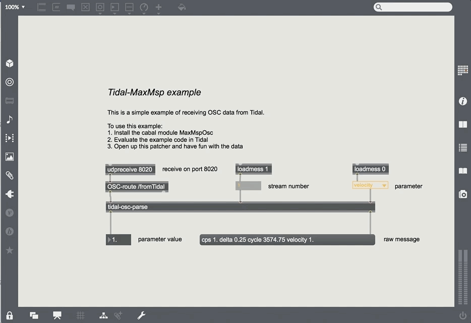

# tidal-maxmsp
Connecting the Tidal live coding environment to MaxMSP

This is a very simple example of how to connect the Haskell based live coding environment Tidal Cycles to MaxMsp via an OSC connection. 

It lets you receive and manipulate data from Tidal parameters and either control visuals in Jitter, use MaxMsp as a synthesis engine for Tidal or whatever your heart desires. 

To be able to use it you need to have Tidal Cycles installed as well as cabal ([learn more]: https://tidalcycles.org/getting_started.html ). 

### How to install:
1. Download this repo
2. Open up the folder MaxMspOsc (a subfolder of the tidal folder) in a terminal and run `cabal install`. This should install a Haskell module on your computer that you will import later on. You only need to do this once. 
3. Open `tidal-maxmsp.maxproj` in Max Msp. This is where you will receive the data from Tidal. 
4. Open up `tidal-maxmsp-example.tidal` and evaluate the import line, one or more of the lines starting with `max1 <-...` and then the last line.
5. Go back to max and see if you receive the data for the velocity parameter that is currently running in Tidal. If you do, congratulations you are now able to live code MaxMsp from Tidal. If not, go check the post window in Tidal for clues and errors.
